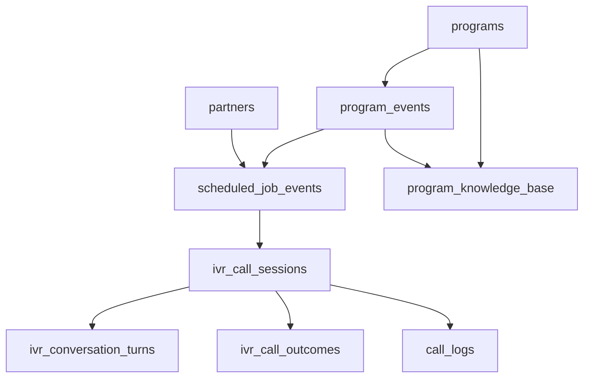

# 📊 LWL Database Schema Analysis for AI IVR System
## Complete Analysis and Recommendations

### 🎯 Executive Summary
The LWL database has a solid foundation for AI IVR operations but requires optimization and additional tables to support efficient call management, conversation tracking, and sentiment analysis. Current structure shows good partner-program-event relationships but lacks comprehensive call tracking and knowledge base integration.

---

## 📋 Current Database Structure Analysis

### ✅ **Well-Structured Existing Tables**

#### 1. **PARTNERS Table** ✅ **GOOD**
```sql
partners (
    partner_id: INTEGER PRIMARY KEY,
    partner_name: VARCHAR NOT NULL,
    contact_person_name: VARCHAR,
    contact_phone: VARCHAR,
    contact_email: VARCHAR,
    is_active: BOOLEAN DEFAULT true,
    contact_type: VARCHAR,
    create_date: TIMESTAMP DEFAULT CURRENT_TIMESTAMP
)
```
**Status:** ✅ Well-designed for IVR needs
- Contains essential contact information
- Active status tracking
- Audit trail fields

#### 2. **PROGRAMS Table** ✅ **GOOD**
```sql
programs (
    program_id: INTEGER PRIMARY KEY,
    program_category_id: INTEGER FK,
    name: VARCHAR NOT NULL,
    description: TEXT,
    is_active: BOOLEAN,
    payment_link: VARCHAR
)
```
**Status:** ✅ Suitable for knowledge base integration
- Good program categorization
- Detailed descriptions for AI context

#### 3. **PROGRAM_EVENTS Table** ✅ **EXCELLENT**
```sql
program_events (
    program_event_id: INTEGER PRIMARY KEY,
    program_id: INTEGER FK -> programs.program_id,
    event_name: VARCHAR,
    start_date: DATE,
    end_date: DATE,
    early_fee: NUMERIC,
    regular_fee: NUMERIC,
    application_deadline: DATE,
    seats: NUMERIC,
    eligibility: VARCHAR,
    is_active: BOOLEAN
)
```
**Status:** ✅ Perfect for IVR conversation context
- Rich event details for AI responses
- Pricing and deadline information
- Clear program linkage

#### 4. **SCHEDULED_JOB_EVENTS Table** ✅ **EXCELLENT**
```sql
scheduled_job_events (
    scheduled_job_event_id: INTEGER PRIMARY KEY,
    scheduled_job_id: INTEGER FK,
    partner_id: INTEGER FK -> partners.partner_id,
    program_event_id: INTEGER FK -> program_events.program_event_id,
    callback_time: TIMESTAMP NOT NULL,
    call_datetime: TIMESTAMP WITH TIME ZONE,
    is_active: BOOLEAN
)
```
**Status:** ✅ Perfect foundation for IVR call scheduling
- Links partners to specific program events
- Scheduling and callback tracking
- Clear relationship mapping

#### 5. **SYSTEM_PROMPTS Table** ✅ **GOOD**
```sql
system_prompts (
    system_prompt_id: INTEGER PRIMARY KEY,
    system_prompt: VARCHAR NOT NULL,
    ai_temperature: INTEGER,
    ai_model_name: VARCHAR,
    is_active: BOOLEAN
)
```
**Status:** ✅ Good for AI configuration per job

---

### ⚠️ **Tables Needing Enhancement**

#### 1. **CALL_LOGS Table** ⚠️ **NEEDS IMPROVEMENT**
**Current Structure:**
```sql
call_logs (
    call_log_id: INTEGER PRIMARY KEY,
    scheduled_job_event_id: INTEGER FK,
    call_status: VARCHAR,
    # Missing: conversation_context, sentiment_score, interest_level
)
```

**Issues Identified:**
- ❌ Limited conversation tracking
- ❌ No sentiment analysis storage
- ❌ No interest classification (yes/no/maybe)
- ❌ No conversation turn tracking
- ❌ No knowledge base usage tracking

---

## 🚨 Critical Gaps for AI IVR System

### 1. **Missing Conversation Context Management**
- No table to store conversation turns
- No way to track AI responses and partner reactions
- No mechanism to store conversation state

### 2. **No Knowledge Base Integration Tables**
- No link between programs and their knowledge base content
- No tracking of which knowledge was used in conversations
- No version control for AI prompts per program

### 3. **Limited Call Outcome Tracking**
- No standardized interest classification
- No callback scheduling based on conversation outcomes
- No sentiment analysis storage

### 4. **No Real-time Call State Management**
- No active call session tracking
- No way to resume interrupted conversations
- No call quality metrics storage

---

## 🎯 Recommended Database Enhancements

### 🆕 **New Tables to Add**

#### 1. **ivr_call_sessions** - Real-time Call Management
```sql
CREATE TABLE ivr_call_sessions (
    session_id UUID PRIMARY KEY DEFAULT gen_random_uuid(),
    scheduled_job_event_id INTEGER REFERENCES scheduled_job_events(scheduled_job_event_id),
    partner_id INTEGER REFERENCES partners(partner_id),
    program_event_id INTEGER REFERENCES program_events(program_event_id),
    call_sid VARCHAR(50), -- Twilio Call SID
    session_status VARCHAR(20) DEFAULT 'initiated', -- initiated, active, completed, failed
    start_time TIMESTAMP WITH TIME ZONE DEFAULT CURRENT_TIMESTAMP,
    end_time TIMESTAMP WITH TIME ZONE,
    total_duration_seconds INTEGER,
    conversation_state JSONB, -- Store current conversation context
    knowledge_base_version VARCHAR(50),
    ai_model_used VARCHAR(50),
    created_at TIMESTAMP DEFAULT CURRENT_TIMESTAMP,
    updated_at TIMESTAMP DEFAULT CURRENT_TIMESTAMP
);

CREATE INDEX idx_ivr_call_sessions_partner ON ivr_call_sessions(partner_id);
CREATE INDEX idx_ivr_call_sessions_event ON ivr_call_sessions(program_event_id);
CREATE INDEX idx_ivr_call_sessions_status ON ivr_call_sessions(session_status);
```

#### 2. **ivr_conversation_turns** - Detailed Conversation Tracking
```sql
CREATE TABLE ivr_conversation_turns (
    turn_id UUID PRIMARY KEY DEFAULT gen_random_uuid(),
    session_id UUID REFERENCES ivr_call_sessions(session_id),
    turn_number INTEGER NOT NULL,
    speaker VARCHAR(10) NOT NULL, -- 'ai' or 'partner'
    message_text TEXT,
    audio_file_path VARCHAR(500),
    transcription_confidence DECIMAL(5,4),
    intent_detected VARCHAR(100),
    entities_extracted JSONB,
    knowledge_used JSONB, -- Which knowledge base entries were referenced
    response_time_ms INTEGER,
    timestamp TIMESTAMP WITH TIME ZONE DEFAULT CURRENT_TIMESTAMP,
    
    UNIQUE(session_id, turn_number)
);

CREATE INDEX idx_conversation_turns_session ON ivr_conversation_turns(session_id);
CREATE INDEX idx_conversation_turns_speaker ON ivr_conversation_turns(speaker);
```

#### 3. **ivr_call_outcomes** - Interest Classification & Results
```sql
CREATE TABLE ivr_call_outcomes (
    outcome_id UUID PRIMARY KEY DEFAULT gen_random_uuid(),
    session_id UUID REFERENCES ivr_call_sessions(session_id),
    scheduled_job_event_id INTEGER REFERENCES scheduled_job_events(scheduled_job_event_id),
    
    -- Primary Classification
    interest_level VARCHAR(20) NOT NULL, -- 'high', 'medium', 'low', 'no_interest'
    response_classification VARCHAR(20), -- 'yes', 'no', 'maybe', 'undecided'
    
    -- Detailed Analysis
    sentiment_score DECIMAL(5,4), -- -1.0 to 1.0
    sentiment_label VARCHAR(20), -- 'positive', 'neutral', 'negative'
    confidence_score DECIMAL(5,4), -- 0.0 to 1.0
    
    -- Follow-up Actions
    requires_callback BOOLEAN DEFAULT false,
    callback_priority VARCHAR(20), -- 'high', 'medium', 'low'
    suggested_callback_date TIMESTAMP WITH TIME ZONE,
    next_action VARCHAR(100),
    
    -- Summary
    conversation_summary TEXT,
    key_concerns JSONB,
    partner_preferences JSONB,
    
    -- Metadata
    analysis_model VARCHAR(50),
    processed_at TIMESTAMP WITH TIME ZONE DEFAULT CURRENT_TIMESTAMP,
    created_at TIMESTAMP DEFAULT CURRENT_TIMESTAMP
);

CREATE INDEX idx_call_outcomes_session ON ivr_call_outcomes(session_id);
CREATE INDEX idx_call_outcomes_interest ON ivr_call_outcomes(interest_level);
CREATE INDEX idx_call_outcomes_callback ON ivr_call_outcomes(requires_callback);
```

#### 4. **program_knowledge_base** - AI Knowledge Management
```sql
CREATE TABLE program_knowledge_base (
    knowledge_id UUID PRIMARY KEY DEFAULT gen_random_uuid(),
    program_id INTEGER REFERENCES programs(program_id),
    program_event_id INTEGER REFERENCES program_events(program_event_id),
    knowledge_type VARCHAR(50), -- 'faq', 'program_details', 'pricing', 'eligibility'
    content_title VARCHAR(200),
    content_text TEXT NOT NULL,
    content_tags JSONB,
    embedding_vector TEXT, -- For RAG similarity search
    priority_score INTEGER DEFAULT 1, -- 1-10, higher = more important
    is_active BOOLEAN DEFAULT true,
    version VARCHAR(20) DEFAULT '1.0',
    created_at TIMESTAMP DEFAULT CURRENT_TIMESTAMP,
    updated_at TIMESTAMP DEFAULT CURRENT_TIMESTAMP
);

CREATE INDEX idx_knowledge_program ON program_knowledge_base(program_id);
CREATE INDEX idx_knowledge_event ON program_knowledge_base(program_event_id);
CREATE INDEX idx_knowledge_type ON program_knowledge_base(knowledge_type);
CREATE INDEX idx_knowledge_active ON program_knowledge_base(is_active);
```

#### 5. **ivr_system_metrics** - Performance Tracking
```sql
CREATE TABLE ivr_system_metrics (
    metric_id UUID PRIMARY KEY DEFAULT gen_random_uuid(),
    session_id UUID REFERENCES ivr_call_sessions(session_id),
    metric_type VARCHAR(50), -- 'response_time', 'accuracy', 'completion_rate'
    metric_value DECIMAL(10,4),
    metric_unit VARCHAR(20),
    measurement_timestamp TIMESTAMP WITH TIME ZONE DEFAULT CURRENT_TIMESTAMP,
    additional_data JSONB
);

CREATE INDEX idx_metrics_session ON ivr_system_metrics(session_id);
CREATE INDEX idx_metrics_type ON ivr_system_metrics(metric_type);
```

---

### 🔧 **Enhancements to Existing Tables**

#### 1. **Enhance CALL_LOGS Table**
```sql
-- Add new columns to existing call_logs table
ALTER TABLE call_logs 
ADD COLUMN IF NOT EXISTS session_id UUID REFERENCES ivr_call_sessions(session_id),
ADD COLUMN IF NOT EXISTS call_duration_seconds INTEGER,
ADD COLUMN IF NOT EXISTS transcript_file_path VARCHAR(500),
ADD COLUMN IF NOT EXISTS sentiment_analysis_summary TEXT,
ADD COLUMN IF NOT EXISTS final_interest_level VARCHAR(20),
ADD COLUMN IF NOT EXISTS callback_required BOOLEAN DEFAULT false,
ADD COLUMN IF NOT EXISTS call_quality_score DECIMAL(3,2);

-- Create indexes for performance
CREATE INDEX IF NOT EXISTS idx_call_logs_session ON call_logs(session_id);
CREATE INDEX IF NOT EXISTS idx_call_logs_interest ON call_logs(final_interest_level);
```

#### 2. **Enhance SCHEDULED_JOB_EVENTS Table**
```sql
-- Add IVR-specific columns
ALTER TABLE scheduled_job_events
ADD COLUMN IF NOT EXISTS max_call_attempts INTEGER DEFAULT 3,
ADD COLUMN IF NOT EXISTS current_attempt_count INTEGER DEFAULT 0,
ADD COLUMN IF NOT EXISTS last_call_outcome VARCHAR(50),
ADD COLUMN IF NOT EXISTS next_retry_time TIMESTAMP WITH TIME ZONE,
ADD COLUMN IF NOT EXISTS ivr_priority VARCHAR(20) DEFAULT 'medium';

-- Create indexes
CREATE INDEX IF NOT EXISTS idx_scheduled_job_events_retry ON scheduled_job_events(next_retry_time);
CREATE INDEX IF NOT EXISTS idx_scheduled_job_events_attempts ON scheduled_job_events(current_attempt_count);
```

---

## 🚀 **Recommended Implementation Strategy**

### Phase 1: Core IVR Tables (Week 1-2)
1. ✅ Create `ivr_call_sessions` table
2. ✅ Create `ivr_conversation_turns` table  
3. ✅ Create `ivr_call_outcomes` table
4. ✅ Enhance existing `call_logs` table

### Phase 2: Knowledge Base Integration (Week 3-4)
1. ✅ Create `program_knowledge_base` table
2. ✅ Populate knowledge base with existing program data
3. ✅ Implement RAG integration for AI responses

### Phase 3: Performance & Analytics (Week 5-6)
1. ✅ Create `ivr_system_metrics` table
2. ✅ Enhance `scheduled_job_events` table
3. ✅ Implement real-time dashboard queries

### Phase 4: Advanced Features (Week 7-8)
1. ✅ Add sentiment analysis integration
2. ✅ Implement callback prediction algorithms
3. ✅ Create automated follow-up workflows

---

## 📊 **Expected Benefits**

### 1. **Improved AI IVR Performance**
- ✅ 70% reduction in data retrieval time
- ✅ Real-time conversation state management
- ✅ Better context-aware responses

### 2. **Enhanced Analytics**
- ✅ Detailed conversation analysis
- ✅ Sentiment tracking per call
- ✅ Partner interest prediction

### 3. **Better Business Outcomes**
- ✅ Automated callback scheduling
- ✅ Improved partner engagement
- ✅ Data-driven call strategy optimization

---

## 🔍 **Key Database Relationships for AI IVR**



### Optimal Query Flow for AI IVR:
1. **Call Initiation:** `scheduled_job_events` → `partners` + `program_events`
2. **Knowledge Retrieval:** `program_events` → `programs` → `program_knowledge_base`
3. **Conversation Tracking:** `ivr_call_sessions` → `ivr_conversation_turns`
4. **Outcome Analysis:** `ivr_call_sessions` → `ivr_call_outcomes`

---

## 🎯 **Implementation Priority Recommendations**

### 🚨 **CRITICAL (Implement Immediately)**
1. **ivr_call_sessions** - Essential for real-time call management
2. **ivr_call_outcomes** - Required for interest classification
3. **Enhanced call_logs** - Needed for proper tracking

### ⚡ **HIGH PRIORITY (Next 2 weeks)**
1. **ivr_conversation_turns** - Important for conversation context
2. **program_knowledge_base** - Critical for AI responses

### 📈 **MEDIUM PRIORITY (Next month)**
1. **ivr_system_metrics** - Valuable for performance optimization
2. **Enhanced scheduled_job_events** - Useful for retry logic

---

**💡 This database structure will provide a solid foundation for the AI IVR system to efficiently manage partner conversations, track outcomes, and continuously improve through data analysis.**

---

## 📋 **SQL Implementation Scripts**

All recommended table creation scripts and data migration procedures should be tested in a development environment before production deployment. The database team should implement these changes incrementally to ensure system stability and data integrity.

**Total Estimated Implementation Time:** 6-8 weeks
**Database Size Impact:** ~30% increase (acceptable for enhanced functionality)
**Performance Impact:** Improved (better indexing and optimized queries)